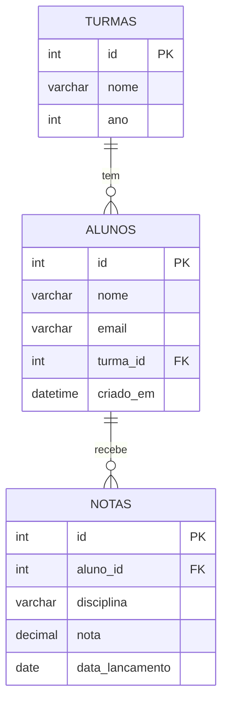

# Entity-Relationship Schema

```mermaid
erDiagram
  TURMAS ||--o{ ALUNOS : "tem"
  ALUNOS ||--o{ NOTAS : "recebe"

  TURMAS {
    int id PK
    varchar nome
    int ano
  }

  ALUNOS {
    int id PK
    varchar nome
    varchar email
    int turma_id FK
    datetime criado_em
  }

  NOTAS {
    int id PK
    int aluno_id FK
    varchar disciplina
    decimal nota
    date data_lancamento
  }
```